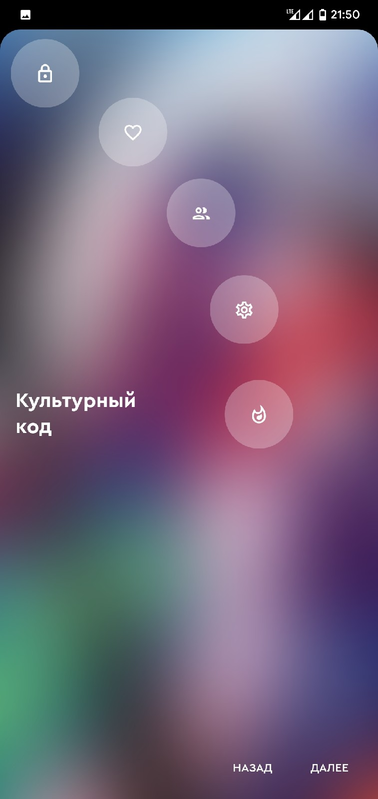
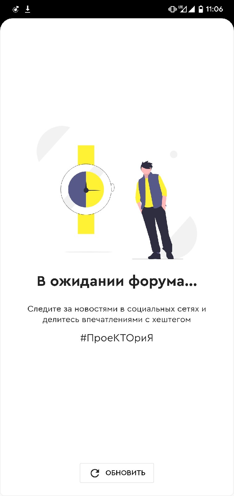
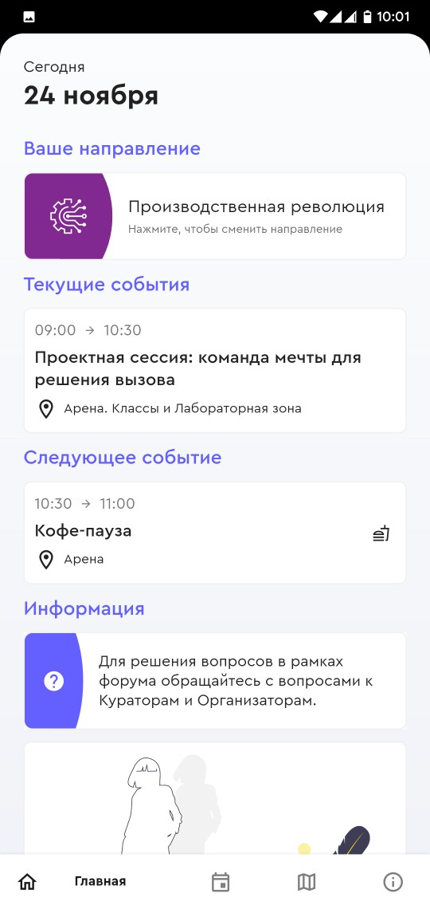
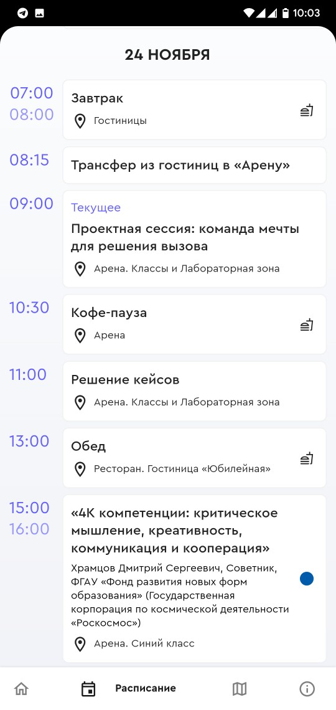
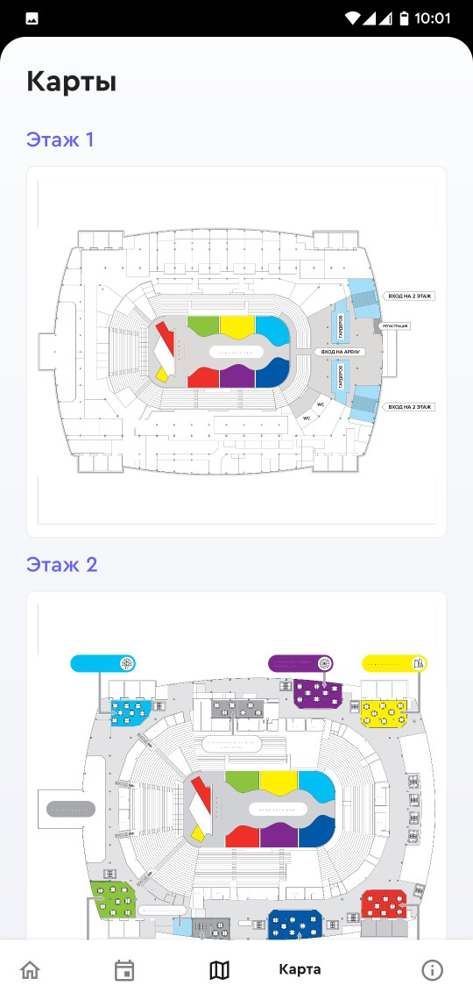

# Восток-27

## О проекте

Приложение-гид для форума профессиональной ориентации «ПроеКТОриЯ» '19.

## Скриншоты

    

## Актуальность данных

Расписание в приложении актуально на момент проведения форума 2019 года.

## Установка

Для установки скачайте apk последнего [релиза приложения](https://github.com/sqxx/proektoria/releases) и установите его стандартными средствами Android.

## Сборка

Для сборки потребуется последняя версия [Flutter](https://flutter.dev/), [Android Studio](https://developer.android.com/studio) и установленный [плагин](https://plugins.jetbrains.com/plugin/9212-flutter) для Android Studio.

Для сборки финального apk требуется создать собственный ключ, файл key.properties. Подробно действия для сборки финального apk описаны [здесь](https://www.diera.ru/blog/publishing-flutter-app-to-play-store/).
